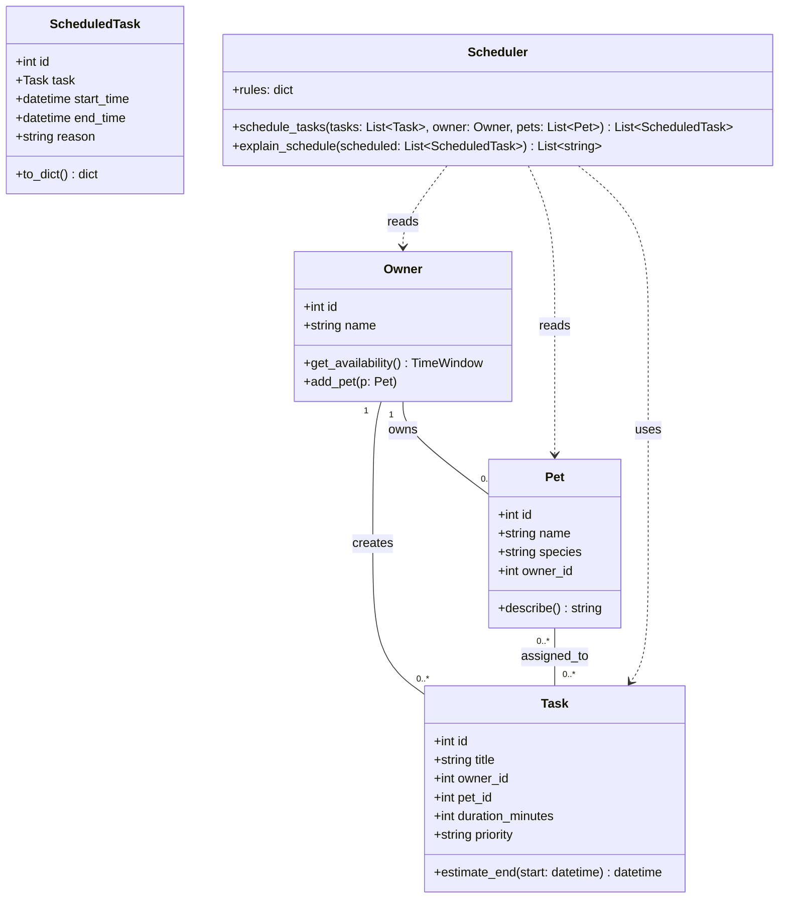
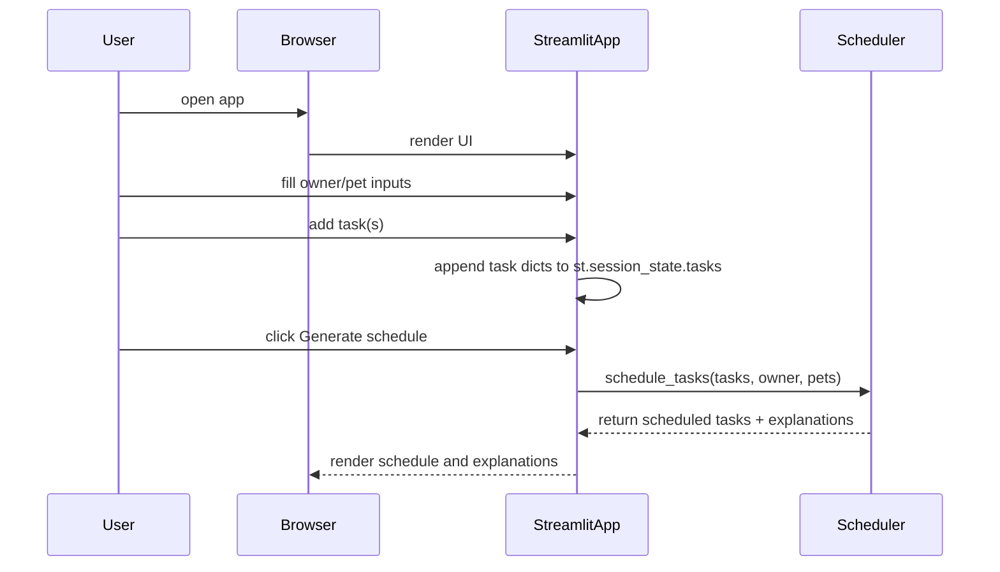

## UML Diagrams for PawPal+

### Mermaid Class Diagram



### Mermaid Sequence Diagram (main flow)



### Mermaid ER Diagram (DB schema)

```mermaid
erDiagram
    OWNERS {
      INTEGER id PK
      TEXT name NOT NULL UNIQUE
    }
    PETS {
      INTEGER id PK
      TEXT name NOT NULL
      TEXT species
      INTEGER owner_id FK
    }
    TASKS {
      INTEGER id PK
      TEXT title NOT NULL
      INTEGER owner_id FK NOT NULL
      INTEGER pet_id FK
      INTEGER duration_minutes NOT NULL
      TEXT priority NOT NULL
    }
    SCHEDULED_TASKS {
      INTEGER id PK
      INTEGER task_id FK UNIQUE
      DATETIME start_time NOT NULL
      DATETIME end_time NOT NULL
      TEXT reason
    }

    OWNERS ||--o{ PETS : owns
    OWNERS ||--o{ TASKS : creates
    PETS ||--o{ TASKS : assigned_to
    TASKS ||--o{ SCHEDULED_TASKS : becomes
```

### SQL DDL (SQLite) with constraints

```sql
-- Owners
CREATE TABLE owners (
  id INTEGER PRIMARY KEY AUTOINCREMENT,
  name TEXT NOT NULL UNIQUE
);

-- Pets
CREATE TABLE pets (
  id INTEGER PRIMARY KEY AUTOINCREMENT,
  name TEXT NOT NULL,
  species TEXT,
  owner_id INTEGER NOT NULL,
  FOREIGN KEY(owner_id) REFERENCES owners(id) ON DELETE CASCADE
);

-- Tasks
CREATE TABLE tasks (
  id INTEGER PRIMARY KEY AUTOINCREMENT,
  title TEXT NOT NULL,
  owner_id INTEGER NOT NULL,
  pet_id INTEGER,
  duration_minutes INTEGER NOT NULL CHECK(duration_minutes > 0),
  priority TEXT NOT NULL CHECK(priority IN ('low','medium','high')),
  FOREIGN KEY(owner_id) REFERENCES owners(id) ON DELETE CASCADE,
  FOREIGN KEY(pet_id) REFERENCES pets(id) ON DELETE SET NULL
);

-- Scheduled tasks
CREATE TABLE scheduled_tasks (
  id INTEGER PRIMARY KEY AUTOINCREMENT,
  task_id INTEGER NOT NULL UNIQUE,
  start_time DATETIME NOT NULL,
  end_time DATETIME NOT NULL,
  reason TEXT,
  FOREIGN KEY(task_id) REFERENCES tasks(id) ON DELETE CASCADE,
  CHECK(end_time > start_time)
);
```

### Notes

- The current repository stores tasks in `st.session_state` as simple dicts. The diagrams above map these dicts to concrete models and an optional SQLite schema.
- The `Scheduler` class is a design-time component: implement `schedule_tasks()` to consume `Task` objects and produce `ScheduledTask` entries that satisfy constraints (time windows, priorities).

If you want, I can also add a `schema.sql` file, stub Python class files for `Owner`, `Pet`, `Task`, and `Scheduler`, and simple unit tests next.
